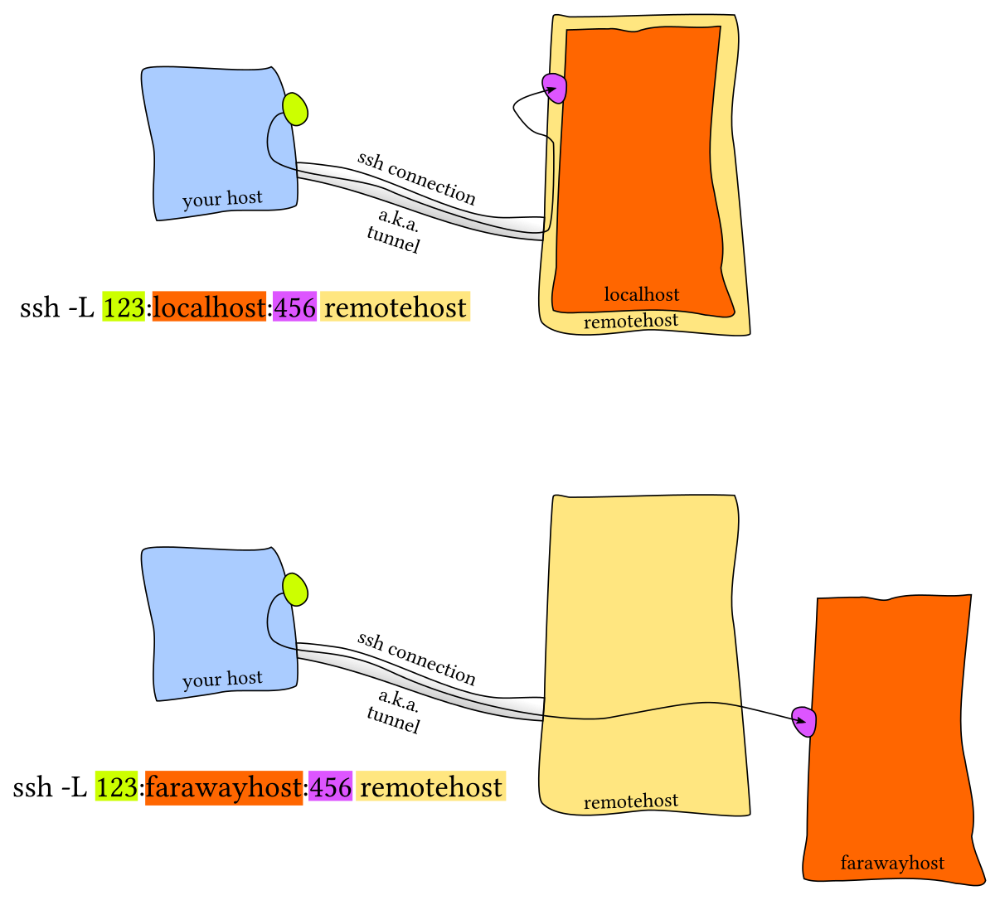

---
tags:
    - shell
    - bash
    - commands
    - linux
---

# Shell commands

In computing, a shell is a computer program that exposes an operating system's services to a human user or other programs. In general, operating system shells use either a command-line interface (CLI) or graphical user interface (GUI), depending on a computer's role and particular operation. It is named a shell because it is the outermost layer around the operating system.

Command-line shells require the user to be familiar with commands and their calling syntax, and to understand concepts about the shell-specific scripting language (for example, [bash](../shells/bash.md)).

## Shell command tips

- [`cd`](#cd)
- [`echo`](#echo)
- [`sort`](#sort)
- [`paste`](#paste)
- [`cut`](#cut)
- [`tr`](#tr)
- [`column`](#column)
- [`update-alternatives`](#update-alternatives)
- [`rename`](#rename)
- [`pwd`](#pwd)
- [`ls`](#ls)
- [`touch`](#touch)
- [`whatis`](#whatis)
- [`whereis`](#whereis)
- [`logrotate`](#logrotate)
- [`watch`](#watch)
- [`od`](#od)
- [`mktemp`](#mktemp)
- [`expand`](#expand)
- [`find`](#find)
- [`xargs`](#xargs)
- [`pushd`, `popd`, `dirs`](#pushd-popd-dirs)
- [`rsync`](#rsync)
- [`envsubst`](#envsubst)
- [`jq`](#jq)
- [System](#system)
- [Networking](#networking)
    - [`netstat`](#netstat)
    - [`nc`, `netcat`](#nc-netcat)
    - [Port scanning](#port-scanning)
    - [Data transfer](#data-transfer)
    - [`tcpdump`](#tcpdump)
    - [`ssh`](#ssh)
    - [ProxyJump](#proxyjump)
    - [`curl`](#curl)
    - [`wget`](../www/wget.md)
- [One liner](#one-liner)
- [Helpful tools](#helpful-tools)
- [List of some useful shell commands](#list-of-some-useful-shell-commands)
- [See also](#see-also)

### `cd`

usually if `cd` is followed by a relative path, it's relative to current working directory, you can change this by setting environment variable `CDPATH`:

    $ pwd
    /home/lee
    $ CDPATH='/etc'; cd apache2
    /etc/apache2
    $ pwd
    /etc/apache2

### `echo`

useful options, `-e` to enable escaping, `-n` to suppress default-added-newline at the end

    $ echo "hello\nworld"
    hello\nworld
    $ echo -e "hello\nworld"
    hello
    world
    $ echo -n "hello\nworld"
    hello\nworld$

### `sort`

Common options:

- `-n` sort as number;
- `-h` compare human readable numbers (e.g., 2K 1G);

    ```sh
    du -sh * | sort -h

    # 4.0K    x.sh
    # 44K     test
    # 12M	    screenshots
    ```

- `-r` sort from big to small;
- `-u` output only first of equal values;
- `-t` for delimiter, if you need to use tab as separator, use `-t$'\t'`;
- `-k` specify sorting fields(`-k3,3` to sort for the third field), and options of each field;

    ```sh
    # sort according to user id from big to small:
    sort -t':' -k3nr,3 /etc/passwd

    # ...
    # bin:x:2:2:bin:/bin:/bin/sh
    # daemon:x:1:1:daemon:/usr/sbin:/bin/sh
    # root:x:0:0:root:/root:/bin/bash
    ```

**CAUTION** if you want to output sort result to the same file as input file, do not use redirection, this will empty the file, as the file will be emptied even before sorting, use `-o` instead:

```sh
sort -o input.file input.file   # use -o
```

### `paste`

merge lines of files, if `-s` is set, merge one file at a time, quite useful for join lines of a file

    $ cat text1
    hello
    world
    $ cat text2
    happy
    new
    year

    $ paste -d'|' text1 text2
    hello|happy
    world|new
    |year

    $ paste -s -d',' text1 text2
    hello,world
    happy,new,year

### `cut`

    $ cut -d: -f1,3 --output-delimiter=' ' /etc/passwd | head -2
    root 0
    daemon 1

### `tr`

```sh
# delete a charater
echo 'a-------------b' | tr -d '-'
# ab

# squeeze multiple occurrences of a character to one
echo 'a-------------b' | tr -s '-'
# a-b

# delete characters not in specified range
# same as: only keep characters from a specified range
echo abc123 | tr -dc 0-9
# 123

# lower to upper case
echo 'ab' | tr -s '[:lower:]' '[:upper:]'
# AB
```

### `column`

columnate text

    $ cat temp.txt
    asia.china
    america.usa
    europe.france

    $ column -s '.' -t temp.txt
    asia     china
    america  usa
    europe   france

### `update-alternatives`

installed multiple version of a program in system, such as:

    $ sudo update-alternatives --display node
    node - auto mode
      link currently points to /usr/bin/nodejs
    /usr/bin/nodejs - priority 50
      slave node.1.gz: /usr/share/man/man1/nodejs.1.gz
    Current 'best' version is '/usr/bin/nodejs'.

    $ node -v
    v0.10.37

there is only one option for node now, we can add another version:

    $ sudo update-alternatives --install /usr/bin/node node /usr/local/n/versions/node/5.4.1/bin/node 80
    update-alternatives: using /usr/local/n/versions/node/5.4.1/bin/node to provide /usr/bin/node (node) in auto mode
    update-alternatives: warning: not removing /usr/share/man/man1/node.1.gz since it's not a symlink

    $ node -v
    v5.4.1

### `rename`

rename multiple files

    $ ls
    greatwall-001.jpg  greatwall-002.jpg  greatwall-003.jpg  greatwall-004.jpg

    $ rename -n 's/-00/-/' *.jpg # see what files would be renamed withoud actual actions
    greatwall-001.jpg renamed as greatwall-1.jpg
    greatwall-002.jpg renamed as greatwall-2.jpg
    greatwall-003.jpg renamed as greatwall-3.jpg
    greatwall-004.jpg renamed as greatwall-4.jpg

    $ rename 's/-00/-/' *.jpg

    $ ls
    greatwall-1.jpg  greatwall-2.jpg  greatwall-3.jpg  greatwall-4.jpg

sanitize filenames

    $ ls 'Hello world (2014) - 720p.mp4'
    Hello world (2014) - 720p.mp4
    $ rename 's/[ \._()-]+/./g' 'Hello world (2014) - 720p.mp4'
    $ ls Hello.world.2014.720p.mp4
    Hello.world.2014.720p.mp4

change file name extensions to lower case

    $ ls hello.world.*
    hello.world.TXT
    $ rename 's/\.([^.]+)$/.\L$1/' hello.world.TXT
    $ ls hello.world.*
    hello.world.txt

change file name to lowercase:

    $ rename 'y/A-Z/a-z/' Apple.Txt
    $ ls
    apple.txt

or

    $ rename 's/(.)/\l$1/g' *

### `pwd`

show working directory, use `-P` to ignore symlinks

    $ ll test
    lrwxrwxrwx 1 lee lee 19 2012-12-19 10:07 test -> /home/lee/code/php//
    $ cd test
    $ pwd
    /var/www/test
    $ pwd -P
    /home/lee/code/php

### `ls`

ouput one file per line, use `-1`

    $ ls
    bar.txt  foo.txt
    $ ls -1
    bar.txt
    foo.txt

### `touch`

update access and modification times of a file, if a file does not exists, it will be created
`-a`: change only access time; `-m`: change only modification time, `-t`: update to a specified time instead of current time

**ctime will always be updated to current time**

atime: file access time

mtime: file content modification time

ctime: file properties modification time

    $ stat hello.txt
      File: `hello.txt'
      Size: 0           Blocks: 0          IO Block: 4096   regular empty file
    Device: 801h/2049d  Inode: 145477      Links: 1
    Access: (0644/-rw-r--r--)  Uid: ( 1000/     lee)   Gid: ( 1000/     lee)
    Access: 2013-05-06 20:03:16.274190365 +0800
    Modify: 2013-05-06 20:03:16.274190365 +0800
    Change: 2013-05-06 20:03:16.274190365 +0800
    $ touch hello.txt
    $ stat hello.txt
      File: `hello.txt'
      Size: 0           Blocks: 0          IO Block: 4096   regular empty file
    Device: 801h/2049d  Inode: 145477      Links: 1
    Access: (0644/-rw-r--r--)  Uid: ( 1000/     lee)   Gid: ( 1000/     lee)
    Access: 2013-05-06 20:03:23.290897995 +0800
    Modify: 2013-05-06 20:03:23.290897995 +0800
    Change: 2013-05-06 20:03:23.290897995 +0800

### `whatis`

`-w`: wildcards, `-s`: limit section

    # search command start with 'wh'
    $ whatis -s 1 -w 'wh*'
    whatis (1)           - display manual page descriptions
    whereis (1)          - locate the binary, source, and manual page files for a com...
    which (1)            - locate a command
    whiptail (1)         - display dialog boxes from shell scripts
    who (1)              - show who is logged on
    whoami (1)           - print effective userid
    whois (1)            - client for the whois directory service

`-r`: regex

    # search command end with 'fox'
    $ whatis -s 1 -r 'fox$'
    firefox (1)          - a free and open source web browser from Mozilla

### `whereis`

    $ whereis php
    php: /usr/bin/php /usr/bin/X11/php /usr/share/man/man1/php.1.gz

    # only search binary path
    $ whereis -b php
    php: /usr/bin/php /usr/bin/X11/php

    # only search manual path
    $ whereis -m php
    php: /usr/share/man/man1/php.1.gz

### `logrotate`

add a custom logrotate config to `/etc/logrotate.d/`

    $ cat apache-rewrite
    /lee/log/rewrite.log {
        #rotate daily
        daily
        #rotate if size greater than this
        size 10M
        #if log file missing, go on withoud issuing an error msg
        missingok
        #how many log files to keep
        rotate 365
        #user, group, mod for newly created log file
        create 640 lee lee
        #add date extension to old log files
        dateext
    }

### `watch`

execute a program periodically, showing output fullscreen

    # run the date command every 1 seconds, and highlight difference
    $ watch -n 1 -d=culmulative date +%H:%M:%S

### `od`

dump files in octal format

    # make sure your console is using utf8 encoding
    $ echo 'a 李' > t.utf8
    $ cat t.utf8
    a 李

    # make a gbk encoded version of the file
    $ iconv -f utf8 -t gbk t.utf8 > t.gbk
    $ cat t.gbk
    a �

    # the utf8 version uses 6 bytes, gbk version uses 5 bytes
    $ wc -c t.utf8 t.gbk
     6 t.utf8
     5 t.gbk
    11 total

    # checkout the actual octals using od
    $ od -t x1c t.utf8
    0000000  61  20  e6  9d  8e  0a
              a     346 235 216  \n
    0000006
    $ od -t x1c t.gbk
    0000000  61  20  c0  ee  0a
              a     300 356  \n
    0000005

the '李' is encoded as `e6 9d 8e` in utf8, `c0 ee` in gbk

to make ubuntu terminal to correctly display gbk characters, see: http://blog.sina.com.cn/s/blog\_a5b3ccfd0101a0u9.html

### `mktemp`

create temporary files or folders

    $ mktemp /tmp/data.XXXX
    /tmp/data.zUFP

    $ mktemp -d /tmp/data-folder.XXXX   # create directory
    /tmp/data-folder.0Fss

### `expand`

expand tabs to whitespace, can be used to align text in columns

    $ cat imagesize
    a.jpg   469x705
    long-name.jpg   705x470
    really-really-long-long-name.jpg    705x470

    $ cat imagesize | expand -t 40
    a.jpg                                   469x705
    long-name.jpg                           705x470
    really-really-long-long-name.jpg        705x470

or use `column`

    $ cat imagesize | column -t
    a.jpg                             469x705
    long-name.jpg                     705x470
    really-really-long-long-name.jpg  705x470

### `find`

```sh
# common usage, matching basename only (both files and directories)
find . -name '*gary*'

# match full path, including basename
find . -path '*/js/*'

# match multiple names
find . -name '*.html' -o -name '*.md'

# or use extended RegEx, matches full path
find . -regextype posix-extended -regex '.*(php)|(phtml)'

# anything last modified at least 10 days ago
find . -mtime +10

# exclude current directory (at least one level deep)
find . -mindepth 1 -type d

# execute a command on matched files
# `{}` is a placeholder for matched files, `\;` is required
find . -type f -regex '\./[1-9]+' -exec cp {} dest \;

# use with xargs, and use null as separator, to handle file names containing white spaces
find . -name '*.png' -print0 | xargs -0 ls -al
```

Given a directory like this:

```
.
├── a.txt
└── subdir
    └── a.txt
```

`-prune -o (...) -print` is a common pattern to ignore a directory:

```sh
find . -name 'subdir' -prune -o -name 'a.txt' -print
# ./a.txt

# equivalent to
find . \( -name 'subdir' -prune \) -o \( -name 'a.txt' -print \)
# ./a.txt

# -print is essential here,
# otherwise a global -print will be applied and './subdir' is output as well
find . \( -name 'subdir' -prune \) -o \( -name 'a.txt' \)
# ./subdir
# ./a.txt
```


### `xargs`

Some shell commands don't take standard input, `xargs` allow you to convert standard input to arguments;

* Print/Confirm commands

    ```sh
    # -t enables printing out commands before execution
    echo A B C | xargs -t echo
    # echo A B C
    # A B C

    # Confirm before execution
    echo A B C | xargs -p echo
    # echo A B C ?...y
    # A B C
    ```

* Placeholder

    Use `{}` as a placeholder, so the argument can be at any position

    ```sh
    find . -name '*.txt' | xargs -i cp {} newFolder
    ```

* How to split inputs

    ```sh
    # By default, all input lines are concatenated:
    echo -e 'a\nb\nc' | xargs -t echo
    # echo a b c
    # a b c

    # You can run one command per input line:
    echo -e 'a\nb\nc' | xargs -t -L 1 echo
    # echo a
    # a
    # echo b
    # b
    # echo c
    # c

    # Or, you can specify how many arguments per command line:
    echo {0..5} | xargs -t -n 2 echo
    # echo 0 1
    # 0 1
    # echo 2 3
    # 2 3
    # echo 4 5
    # 4 5
    ```

* Run multiple processes

    ```sh
    # run multiple processes at the same time to speed up
    docker ps -q | xargs -n 1 --max-procs 2 docker kill
    ```

### `pushd`, `popd`, `dirs`

`pushd` can create an dirs stack, which can be inspected by `dirs`, and then you can use `cd ~` to jump between different dirs

    $ pwd
    /home/lee/playground/testing

    $ mkdir dir1 dir2
    $ dirs -v
     0  ~/playground/testing

    $ pushd dir1
    ~/playground/testing/dir1 ~/playground/testing
    $ pushd ../dir2
    ~/playground/testing/dir2 ~/playground/testing/dir1 ~/playground/testing
    $ pushd .
    ~/playground/testing/dir2 ~/playground/testing/dir2 ~/playground/testing/dir1 ~/playground/testing

    $ dirs -v
     0  ~/playground/testing/dir2
     1  ~/playground/testing/dir2
     2  ~/playground/testing/dir1
     3  ~/playground/testing

    $ cd ~2
    $ pwd
    /home/lee/playground/testing/dir1

    $ dirs -v
     0  ~/playground/testing/dir1
     1  ~/playground/testing/dir2
     2  ~/playground/testing/dir1
     3  ~/playground/testing

    $ cd ~1
    $ pwd
    /home/lee/playground/testing/dir2

### `rsync`

```sh
# sync everything in src/ folder to dest/ folder
rsync -avp src/ ./dest

# sync everything including src/ folder to dest/
rsync -avp src ./dest

# everything only in dest/ will be deleted
rsync -avp --delete src/ ./dest
```

### `envsubst`

Replace variables in strings/files

```sh
# greeting.txt
Hello ${name} !
```

```sh
export name=Gary

cat greeting.txt | envsubst
# Hello Gary !
```

### `jq`

Command line JSON processor

Use an example JSON file `example.json`

```json
{
  "name": {
    "first": "Gary",
    "last": "Li"
  },
  "fruits": [
    "apple",
    "banana",
    "kiwifruit"
  ]
}
```

```sh
# default, output as JSON
jq '.name.first' example.json
# "Gary"

# output raw text
jq -r '.name.first' example.json
# Gary

# array element
jq -r '.fruits[1]' example.json
banana
```

Format JSON text:

```sh
echo '{"name": {"first": "Gary", "last": "Li"}}' | jq .
# {
#   "name": {
#     "first": "Gary",
#     "last": "Li"
#   }
# }
```

### System

- `uptime`  system uptime
- `who`     who is logged in
- `whoami`  current username
- `uname`   kernel info
- `lsb_release -a`  Linux distro info
- `lsof | grep fileName` find what program opened a file


### Networking

#### `netstat`

```sh
# show listening processes
netstat -lntp
# ...
# Proto Recv-Q Send-Q Local Address           Foreign Address         State       PID/Program name
# tcp        0      0 127.0.0.1:5037          0.0.0.0:*               LISTEN      9772/adb
# ...
```

`ss` and `lsof` can do similar things

#### `nc`, `netcat`

#### Port scanning

```sh
# time out in 3 seconds
nc -zvw3 localhost 22
# Connection to localhost 22 port [tcp/ssh] succeeded!

# scan a port range
nc -zvw3 host.example.com 20-30
```

#### Data transfer

using nc to send files

at remote host `dev`:

```sh
$ cat test.txt
hello world
$ nc -l 5555 < test.txt     # start listening
```

at localhost:

```sh
$ nc dev 5555               # connect to a remote port
hello world
```

#### `tcpdump`

- Capture hosts based on IP address

    ```sh
    # -nn: don't resolve host and port
    sudo tcpdump -nn host 8.8.8.8

    # ...
    # 20:49:09.586763 IP 172.27.247.166.47917 > 8.8.8.8.53: 55856+ [1au] A? apple.com. (50)
    # 20:49:09.622909 IP 8.8.8.8.53 > 172.27.247.166.47917: 55856 1/0/1 A 17.253.144.10 (54)
    ```


#### `ssh`

- Port Forwarding (tunneling)

    

    Port forwarding, any connection to local port 123 is forwarded to `localhost:456` on `remotehost`

    ```sh
    ssh -L 123:localhost:456 -N -T remotehost
    ssh -L 123:farawayhost:456 -N -T remotehost
    ```

    - `-N` do not execute any remote commands
    - `-T` disable pseudo tty allocation


- Reverse tunneling

    

    Any connection to remotehost's port 123 is forwarded to `localhost:456` on your host

    ```sh
    ssh -R 123:localhost:456 -N -T remotehost
    ssh -R 123:nearhost:456 -N -T remotehost
    ```

- Use ssh as a SOCKS proxy:

    ```sh
    # start a SOCKS proxy: localhost:8080
    ssh -fnNC -D 8080 remotehost
    ```

#### ProxyJump

In `~/.ssh/config`, use `ProxyJump` to SSH via a hop:

```sh
Host hop
    User gary
    IdentitiesOnly yes
    IdentityFile ~/.ssh/id1.pem

Host dest
    User gary
    HostName destHostName
    IdentitiesOnly yes
    IdentityFile ~/.ssh/id2.pem
    ProxyJump hop
```

then `ssh dest` will login you to `dest` via `hop`

- `id1.pem` and `id2.pem` are on local;
- `hop` need to be able to resolve `destHostName`;

Then we could also forward a local port to a port on `dest` like:

```sh
ssh -L 80:localhost:8080 -N dest
```

#### `curl`

- [cURL cheat sheet](../www/curl.md)

- Post JSON data

    ```sh
    curl -X POST 'https://example.com' \
        -H 'Content-Type: application/json' \
        -d '{ "name": "Gary" }'
    ```

- Output connection time info
    ```sh
    curl -I -w "\n namelookup: \t\t%{time_namelookup} \n connect: \t\t%{time_connect} \n appconnect: \t\t%{time_appconnect} \n pretransfer: \t\t%{time_pretransfer} \n starttransfer: \t%{time_starttransfer} \n total: \t\t%{time_total}\n" https://www.google.com

    ...

    namelookup:            0.001128
    connect:               0.033624
    appconnect:            0.173827
    pretransfer:           0.174055
    starttransfer:         0.372834
    total:                 0.373073
    ```

  - `connect` TCP connect time
  - `appconnect` includes SSL/SSH connect/handshake time
  - `starttransfer` includes `pretransfer` and the time the server needed to calculate the result

- Fake the `Host:` header

    ```sh
    curl -H 'Host: example.com' http://127.0.0.1
    ```

  - Works for HTTP only
  - If you follow redirects, the fake `Host:` header would be sent to those requests as well

- For HTTPS

    ```sh
    curl --resolve example.com:443:127.0.0.1 https://example.com/
    ```

    - This populates curl's DNS cache with a custom entry for `example.com` port 443 with the address `127.0.0.1`
    - `example.com` is used as the SNI field in TLS handshake, so the server can send the correct certificate back
    - `example.com` is used as `Host:` header as well

- Output headers only

    ```sh
    # -s : silent
    # -S : show-error
    # -L : follow redirection
    # '-D -': dump header to stdout
    # '-o /dev/null': discard data
    curl -sSL -D - -o /dev/null www.example.com.org
    ```

### One liner

- `man 7 ascii` get ASCII table


### Helpful tools

`tldr` gives you usage examples for commands, so you don't need to read lengthy man pages

```sh
npm install -g tldr

tldr tar
```

### List of some useful shell commands 

| Description          | Command                                    |
|----------------------|--------------------------------------------|
| Battery fine-tuning: | `sudo tlp-stat -b && sudo tlp recalibrate` |
| Htop like battery draining report: | `powertop` |
| Open a file with the default app from terminal: | `xdg-open test.html` |
| Get audio and video file details: | `mediainfo file.mp3` |
| Pulse audio terminal mixer: | `pulsemixer` |
| Convert .bin/.cue to .iso: | `bchunk IMAGE.bin IMAGE.cue IMAGE.iso` |
| Network bandwidth monitor: | `sudo apt install bmon` |
| Allow user write to mounted partition: | `sudo chown -v [username]:[username] /media/[username]/[disk_name]` |
| Put the system in stand by: | `systemctl suspend` |
| Count number of lines in a project: | <code>find . -name '*.java' &#124; xargs wc -l</code>|
| Manjaro GUI package manager: | `pamac-manager` |
| Shell script code analyzer: | `shell [filename]` |
| Get the next word in a matching pattern: | `awk '{for(i=1;i<=NF;i++)if($i~/patternText/)print $(i+1)}'` |
| Search for a package: | `aptitude search mpv` |
| Command & Conquer: Tiberian Sun | `sudo snap install cnctsun` |
| Create a useless process: | `tail -f /dev/null` |
| Change timezone (Debian based only): | `sudo dpkg-reconfigure tzdata` |
| Copy symlinks: | `cp -a` |
| Remove all Unicode characters from file names: | <code>for i in *.mp3;do mv "$i" $(echo "$i" &#124; sed -e 's/[^A-Za-z0-9._-]//g');done;</code> |
| Restoring deleted file from NTFS file system (restoring files from a drive): | `sudo ntfsundelete /dev/sdbx -u -m '*'` |
| Restoring deleted file from NTFS file system (scan a drive): | `sudo ntfsundelete -s /dev/sdx` |
| Check empty directories in the current path: | <code>for dr in `ls`; do if [ -z "$(ls -A $dr)" ]; then echo "$dr is empty"; fi; done</code> |
| Sort naturally and one item per line: | `ls -1av` |
| Find lines are not available in file2.txt: | `grep -f file2.txt -vFx file1.txt` |
| Format HTML code: | `tidy -im index.html` |
| Bash go to the begining of a line: | `Ctrl + a` |
|  Bash go to the end of a line: | `Ctrl + e` |
| Bash skip one word backward: | `Ctrl + left arrow key Or Alt + b` |
| Bash skip one word forward: | `Ctrl + right arrow key Or Alt + f` |
| Bash delete to the begining of a line: | `Ctrl + u` |
| Bash delete to the end of a line: | `Ctrl + k` |
| Bash delete to the end of a word: | `Alt + d` |
| Bash reverse search: | `Ctrl + r` |
| Mount flash drive: | `sudo fdisk -l && udisksctl mount --block-device /dev/sd[b][1]` |
| Connect to WiFi: | `sudo nmtui` |
| Convert tree command output to ASCII characters: | <code>tree &#124; sed 's/├/\+/g; s/─/-/g; s/└/\\/g'</code> |
| Epub reader: | `sudo apt install fbreader` |
| Append two pictures horizontally: | `convert +append 1.jpg 2.jpg out.jpg` |
| Append two pictures vertically: | `convert -append 1.jpg 2.jpg out.jpg` |
| Cutting part of a pdf file: | `pdftk input_file.pdf cat 10-20 output output_file.pdf` |
| Install Latex package: | `tlmgr install packageName` |
| Convert Latex file to Pdf: | `pdflatex file.tex` |
| Update locate database index: | `updatedb` |
| Search a file from index of files (fast search): | `locate` |
| Pop the path from stack (change directory) to stack path: | `popd` |
| Push the path to stack: | `pushd $PWD` |
| Processor info: | `cat /proc/cpuinfo` |
| Found distro: | `more /etc/*release` |
| Output command output to clipboard (Ctrl + v): | `ls > xclip -selection clipboard` |
| Output command output to clipboard (middle click): | `ls > xclip` |
| Cancel the planned shutdown: | `shutdown -c` |
| Shutdown in 15 minutes: | `shutdown -h 15` |
| Show add drives with UUID an filesystem: | `blkid` |
| Force scan disk in the next reboot: | `touch /forcefsck` |
| Show hidden file in Nautilus: | `Ctrl + H` |
| Reload .bashrc fine: | `. ~/.bashrc` |
| Which process at the moment using I/O: | `iotop --only` |
| List of process using I/O: | `iotop` |
| Which process using the Internet: | `nethogs` |
| Merge Pdf files: | `pdfunite in.pdf in_1.pdf out.pdf` |
| Access to SAMBA folders: | `/run/user/1000/gvfs` |
| Play subdirectories files in Mplayer: | `mplayer -playlist <(find "$PWD" -type f)` |
| Convert Decimal to Hex & Octal: | `printf "Octal: %o\n Hex: %x" 42 42` | 
| Convert Hex to Decimal: | `echo $((0xFF))` | 
| Install JavaFx OpenJdk: | `sudo apt-get install openjfx` | 
| Install pip3: | `sudo apt-get install python3-pip` | 
| Install pip: | `sudo apt-get install python-pip` |
| Convert .md file to html: | `pandoc README.md > README.html` | 
| Open formatted .md file: | <code>pandoc README.md &#124; lynx -stdin</code> | 
| Mv make directory: | `mkdir -P ~/temp; mv File $_` | 
| Search in apt repositories: | `sudo apt-cache search [Keyword]` | 
| Wget download limit, continue, verbose: | `wget -vc --show-progress --limit-rate=200K [link]` | 
| Creat .tar.xz file: | `tar -cvJf [Dot.xz] [Files/Directories]` |
| Extract .tar.xz file: | `tar -xvJf [Dot.xz]` |
| Create .xz file: | `xz -z [A file]` |
| Extract .xz file: | `xz -d [Dot.xz]` |
| Vim selection shortcut: | `v [normal selection], Shift + v [whole line]` |
| Vim cut shortcut: | `d or Shift + d` |
| Vim paste shortcut: | `p [next to cursor], Shift + p [same place cursor]` |
| Vim copy shortcut: | `y or Shift + y` |
| Identifying which port MySQL is running: | <code>sudo netstat -tlpn &#124; grep mysql</code> | 
| Automatically indent C/C++ code: | `indent MyCode.c` | 
| Changing/removing passphrase from SSH private key: | `ssh-keygen -f id_dsa -p` | 
| Run command upon SSH: | `ssh test@testserver 'ls && rm -rvf tmp'` | 
| SSH in reverse tunneling: | `ssh -fN -R 7000:localhost:22 username@yourMachine-ipaddress` | 
| SSH in tunneling: | `ssh -fN -L 7000:localhost:22 username@yourMachine-ipaddress` | 
| SSH in background : | `ssh -f test@testserver` | 
| Grep search string starting with - : | `grep -- "-test"` | 
| List sub directories only : | `ls -d */` | 
| List directory sort by file size : | `ls -S` | 
| List directory with its sub directory contents : | `ls -R` | 
| Run GUI app on a remote PC using SSH : | `export DISPLAY=:0` | 
| Scan computers open ports in a network : | `nmap XXX.YYY.ZZZ.*` | 
| Getting a Heroku app live log : | `heroku logs -t --app APP_NAME` | 
| Counting number of occurence of ';' char in each line of a file : | <code>while read line; do echo "$line" &#124; tr -cd  ";" &#124; wc -c; done < 'FILE'</code> |
| Removing space from a file : | <code>cat FILE &#124; sed 's/ //g'</code> |
| Randomly shuffling files in bash : | <code>cat FILE1 FILE2 &#124; shuf</code> |
| Updating Ubuntu packages in terminal : | `sudo apt-get upgrade` |
| Removing old kernels in Ubuntu : | `sudo apt-get autoremove` |
| Add word prediction to Vim permanently : | `echo set complete+=kspell >> ~/.vimrc` |
| Add permanent spell checking for Vi for .txt files : | `echo autocmd BufRead,BufNewFile *.txt setlocal spell >> ~/.vimrc` |
| Add line number permanently to Vi : | `echo set number >> ~/.vimrc` |
| Find wireless card chipset information : | <code>lspci &#124; grep -i wireless</code> |
| Making soft link without giving full path : | `ln -s [$(pwd)/fileName] [des path]` |
| Making soft link : | `ln -s [src path] [des path]` |
| Finding a location of man page : | `man -wa foo` |
| Activating Vim spell checker : | `set spell spellang=en_us` |
| Mounting Virtualbox share folder : | `mount -t vboxsf [Share folder name] [Mount point]` |
| Search for package in Apt : | `apt-cache search [Keyword]` |
| Accessing ssh with key : | `ssh -i [Public key] user@domain` |
| Accessing *new* sftp with key : | `sftp -i [Public key] user@domain` |
| Accessing *old* sftp with key : | `sftp -o IdentityFile=[Public Key] user@domain` |
| Comparing text files : | `vimdiff [File1] [File2]` |
| Sync files (copy) : | `rsync -avh --progress [source] [destination]` |
| Move progress bar : | `rsync -avh --progress --remove-source-files [source] [destination]` |
| Compare pdf files : | `diffpdf` |
| Forward Gnome via SSH : | `ssh -X -C user@192.168.1.1 and gnome-session` |
| Set password for teamviewer from Terminal : | `sudo teamviewer --passwd mypassword` |
| Get your public IP : | `curl ifconfig.me` |
| Console matrix screen saver : | `cmatrix` |
| Printing something constantly : | `yes say hello` |
| Reverse word : | `rev` |
| Extract the sentence after particular word and replace with comma, sort and remove duplicate values : | <code>less Mylog.txt &#124; grep -o 'world.*' &#124; cut -f2- -d':' &#124; tr -s ',' '\n' &#124; sort &#124; uniq</code> |
| Replace comma with new line : | <code>less Mylog.txt &#124; tr -s ',' '\n'</code> |
| Extract the sentence after particular word in a file : | <code>less Mylog.txt &#124; grep -o "word.*" &#124; cut -f2- -d':'</code> |
| Knowing who is logged in : | `sudo w` |
| Getting the last system reboot : | `sudo last reboot` |
| Getting the ip of the hostname : | `sudo hostname -i` |
| Getting the system hostname : | `sudo hostname` |
| Getting the system uptime : | `sudo uptime` |
| Giving ownership of a file to a user : | `sudo chown Username FileName` |
| Adding user to a group : | `sudo useradd -G G-Name Username` |
| Removing vocal from song : | `sox 1.mp3 1_no_vocal.mp3 oops` |
| Gray Scaling picture : | `convert IMAGE.png -colorspace Gray IMAGE1.png` |
| Resizing picture : | `convert IMAGE.png -resize 200x100 IMAGE1.png` |
| Sorting & getting unique values of 31th column of a CSV file : | <code>awk -F ',' '{print $31}' FILE.csv &#124; sort &#124; uniq</code> |
| Sorting 31th column of a CSV file : | <code>awk -F ',' '{print $31}' FILE.csv &#124; sort</code> |
| Filtering 3rd and 31th columns of a CSV file based on a string : | <code>awk -F ',' '{print $6, $31}' FILE.csv &#124; grep 'STRING'</code> |
| Getting 3rd and 31th columns from a CSV file : | `awk -F ',' '{print $6, $31}' FILE.csv` |
| Getting number of columns of a CSV file : | <code>head -1 FILE.csv &#124; sed 's/[^,]//g' &#124; wc -c</code> |
| Discover hosts and services on a computer network : | `nmap 192.168.0.1` |
| Getting number of files in a folder : | <code>ls -l &#124; wc -l</code> |
| Checking niceness of a comand : | `nice` |
| An interactive process manager : | `htop` |
| Create a directory on specific path : | `mkdir -p /home/kasra/test` |    
| Getting directory size : | `du -sh` |
| Command line calander : | `cal` |
| Showing last K line of file : | `tail 1.txt -n K` |
| Showing first K line of file : | `head 1.txt -n K` |
| Monitor file updates/change : | `tail -f 1.txt` |
| Looking for a file : | `find / -name foo` |
| Sort lines of text files : | `sort 1.txt` |
| Sort lines of text files : | `sort 1.txt` |
| Execute command after exit Shell : | `nohup command-name &` |
| Counting number of <strong>line</strong> in a file : | `wc -l FileName` |
| Counting number of <strong>word</strong> in a file : | `wc -w FileName` |
| Counting number of <strong>character</strong> in a file : | `wc -m FileName` |
| Initializing the console again : | `reset` |
| Getting full path of a file : | `realpath 1.txt` |
| Create arguments for commands : | `xrags` |
| Update access and modification date of files without opening : | `touch 1.txt` |
| Sticky note : | `sudo apt-get install xpad` |
| CLI note : | `sudo apt-get install note` |
| Change default editor for Crontab : | `sudo select-editor` |
| Crontab log file : | `grep CRON /var/log/syslog` |
| Writing in a multiple files at same time : | <code>ls &#124; tee f1.txt f2.txt</code> |
| Play noise with output of a command : | <code>ls &#124; aplay</code> |
| Print the route packets trace to network host : | `traceroute google.com` |
| Display manual page descriptions : | `whatis ls` |
| Historical events calendar : | `calendar` |
| Getting content of a file sorted : | `sort f1.txtr` |
| Running sudo command without entering password : | <code>echo "rootPassword" &#124; sudo -S mkdir /root/test123</code> |
| Executing multiple commands with sudo : | `sudo -- sh -c 'rm -rvf /root/test123; whoami; mkdir /root/tpx'` |
| Shutdown pc : | `shutdown -h now` |
| Getting kernel version : | `uname -r` |
| Getting distro & release version : | `lsb_release -a` |
| Getting a website ip address : | `nslookup www.google.com` |
| Getting a domain information : | `whois www.google.com` |
| Ping a server with a port (TCP) : | `nc -vz 192.168.0.1 8080` |
| Ping a server witha port (UDP) : | `nc -vz -u 192.168.0.1 8080` |

## See also

- [Bash](../shells/bash.md)
- [Zsh](../shells/zsh/zsh.md)
- [Kitty](../terminal/kitty/kitty.md)
- [iTerm2](../terminal/iterm2.md)
- [Awk](../linux/awk.md)
- [Chmod](../linux/chmod.md)
- [cURL](../www/curl.md)
- [Grep](../linux/grep.md)
- [Linux](../linux/linux.md)
- [Linux Basics](../linux/linuxbasics.md)
- [Mount](../linux/mount.md)
- [Nmap](../networking/nmap.md)
- [Regular Expressions](../linux/regex.md)
- [Sed](../linux/sed.md)
- [SSH](../linux/ssh.md)
- [Wget](../www/wget.md)
