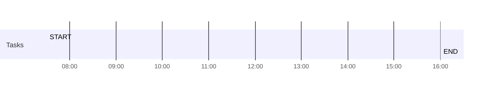

## Day Planner

- [ ] 07:30 START
- [ ] 16:00 END

## On This Day...

[[2020-<%tp.date.now("MM-DD")%>]]

---
[[<%tp.date.yesterday("YYYY-MM-DD")%>]] <== <button class="date_button_today">Today</button> ==> [[<%tp.date.tomorrow("YYYY-MM-DD")%>]]

<%* if (tp.date.now("M") == 1 & tp.date.now("D") < 5) { %>
- [ ] Do Annual Review
<%* } %>
<%* if (tp.date.now("D") < 6) { %>
- [ ] Do Monthly Review
<%* } %>
<%* if (tp.date.now("ddd") == "Fri") { %>
- [ ] Do Weekly Review
<%* } %>
