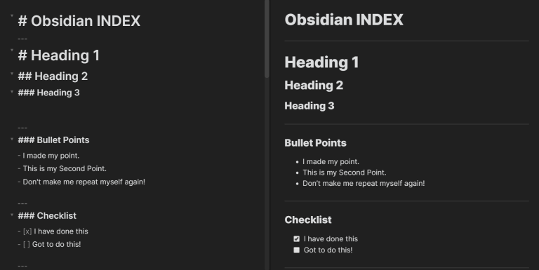
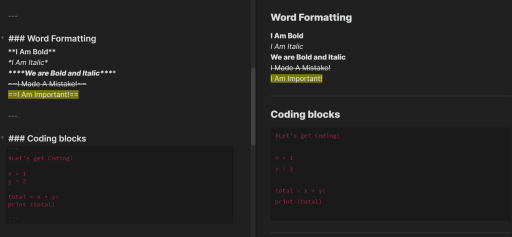

# Obsidian Cheat Sheet and Shortcut Keys 🔮

See the [Obsidian Help](https://help.obsidian.md/Obsidian/Index) website for full documentation on Obsidian usage.

Word Formatting & Coding Blocks            |  Links, Quotes & Tables
:-------------------------:|:-------------------------:
  |  

---
# Markdown Cheat Sheet 💻
<details>
  <summary><em><strong>Mini Cheat Sheet (click to expand) ✨</em></strong></summary>
  
  ``` 
# Heading 1

## Heading 2

-- Spacer  

- Bullet Points

- [x] Checklist

**Bold**

*Italic*

***Italic Bold***

==Highlights==

```Coding Blocks```

[Links](Sources)

> Quotes/ Blockquotes

Table Cell A  |  Table Cell B
----          |          ----

```
</details>


<details>
  <summary><em><strong>Detailed Cheat Sheet (click to expand) 🔥</em></strong></summary>

 # Heading 1
 
```# Heading 1 ```

---

## Heading 2

```## Heading 2 ```

---

**Line Break**

``` ---  ```

---

- Bullet Points

``` - Bullet  ```

---

- [X] Checklist

``` - [x] list  ```

---

**Bold**

``` **text**  ```

---

*Italic*

```  *text* ```

---

***Italic Bold***

``` ***text***  ```

---

**==Highlights==**

``` ==this text is highlighted==```

---

**```Coding Blocks```**

``` By putting 3 (`) signs before and after the code.  ```

---

**[Links]**

``` [link](sources)  ```

---

> Quotes/ Blockquotes

``` > this is a quote.  ```

---

Table Cell A  |  Table Cell B
----          |          ----


```
Table Cell A  |  Table Cell B
----          |          ----
```
</details>


---
# Shortcuts ⌨️

### General Shortcuts 🕹️
Shortcut Key		|		Functions
:-----------------:|-----------------:
Ctrl + S|Editor: Saves the file
Ctrl + N| Creates a new note
Ctrl + P| Open command pallete
Ctrl + O | Opens Quick Switcher
Ctrl + Shift + F  | Search in all files
Ctrl + G   | Opens graph view
Ctrl +  Alt + ← | Navigate Back
Ctrl +  Alt + → | Navigate forth
Ctrl + F | Searches current file
Ctrl + E | Toggle edit/preview modes
Ctrl + , | Open Settings
Ctrl + Tab | Next tab
Ctrl + Shift + Tab | Previous tab
Alt + Tab | Next App
Alt + Shift + Tab | Previous App
Win + Tab | Task View
Win + Shift + Tab |  Next Window


### Editing Shortcuts 🕹️
Shortcut Key		|		Functions
:-----------------:|-----------------:
Ctrl + B | Bold Selected Text
Ctrl + I | Italicize Selected Text
Ctrl + K | Insert External Link to Selected Text
Ctrl + ] | Indent
Ctrl + `[` | Unindent
Ctrl + D |Delete current line
Ctrl + V  | Duplicate current line
Ctrl + Click | Open Note in Current Panel via Link	
Ctrl + Shift + Click | Open Note in New Panel via Link	

